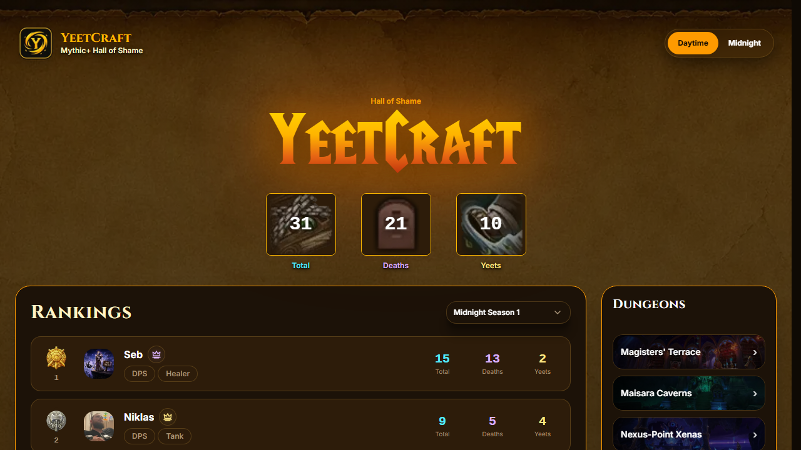
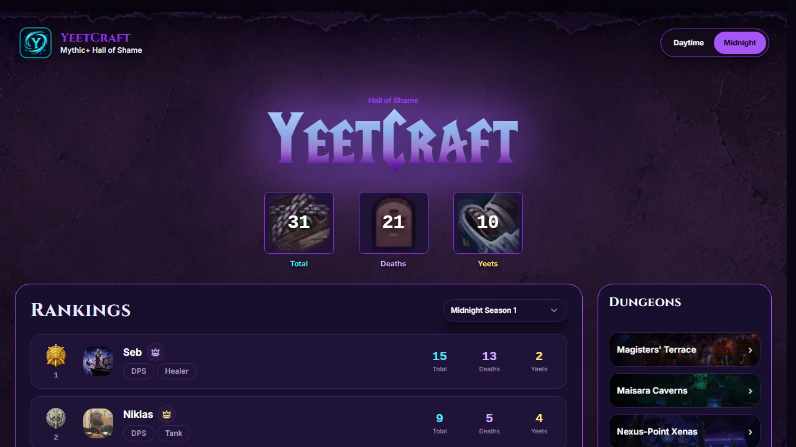
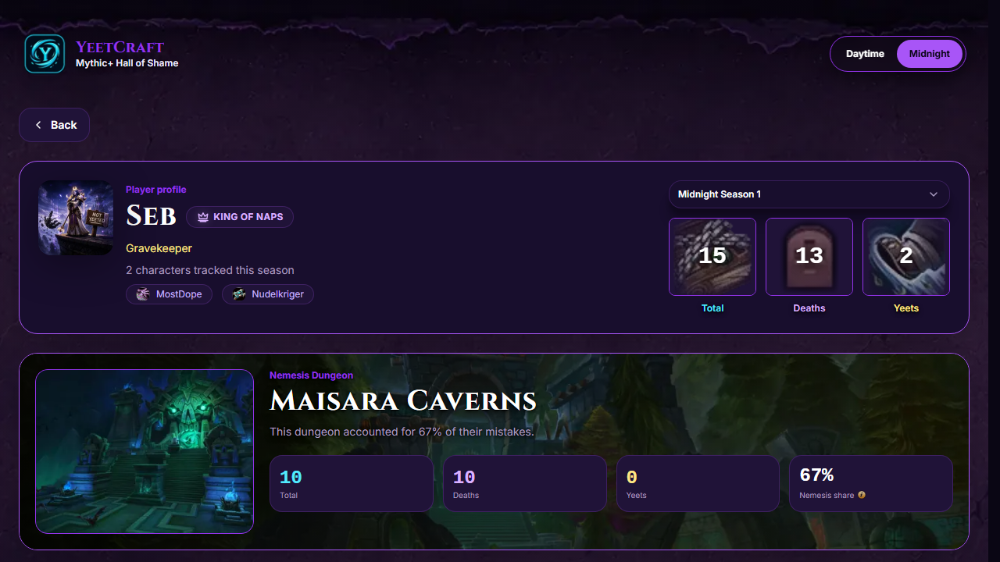
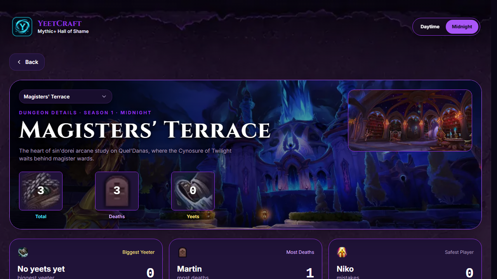
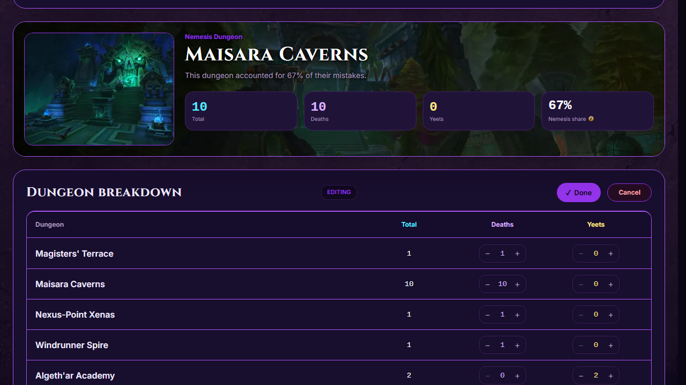
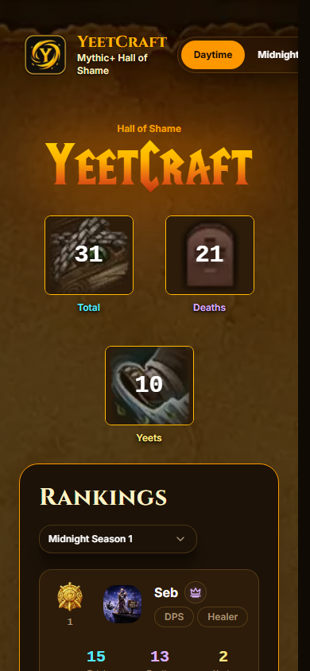
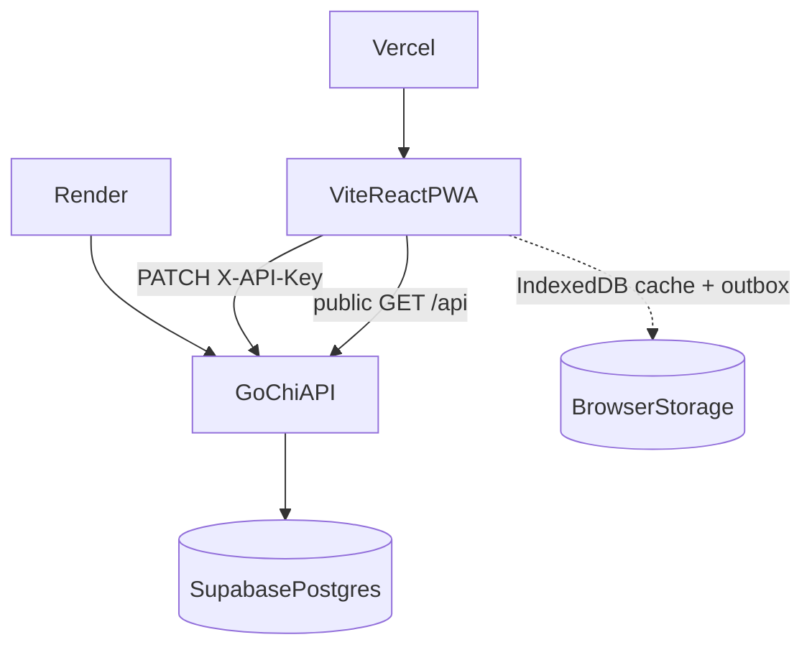

<div align="center">


# Yeetcraft

**A season-aware Hall of Shame for tracking WoW dungeon deaths and yeets with friends.**

Full-stack tracker for Mythic+ mistakes across seasons — rankings, player profiles, dungeon insights, and token-gated editing.

[Highlights](#technical-highlights) · [Screenshots](#screenshots) · [Architecture](#architecture) · [Local setup](#running-locally)


</div>

## Technical Highlights

- **Offline-first PWA** — service worker shell, IndexedDB query cache, and a write outbox for edits
- **Public reads / token-protected writes** — fail-closed if `API_KEY` is unset (503 on mutations)
- **Go + chi + pgx** over Supabase Postgres — backend-only data plane with RLS and no public policies
- **Lighthouse-minded performance** — Desktop Perf **99 / 99 / 98** on home / player / dungeon ([details](docs/PERFORMANCE.md))
- **Multi-layer tests** — Vitest, Go unit/handlers, Postgres integration, Playwright E2E
- **Daytime / Midnight dual-theme UI** — WoW-inspired tokens, art, and typography

## Why I Built This

Yeetcraft started as a way for our friend group to track dungeon deaths and “yeets” across Mythic+ seasons — a shared Hall of Shame instead of a forgotten spreadsheet.

The banter needed something we would actually open mid-session: season rankings, per-dungeon blame, and a simple way for anyone with the link to update scores.

Along the way it became a deliberate full-stack project: a small hardened Go API, an offline-capable React PWA, and enough tests and performance work that the “fun tracker” also holds up as engineering practice.

## Screenshots

<p align="center">
  
  <br />
  <em>Hall of Shame — Daytime</em>
</p>

<p align="center">
  
  <br />
  <em>Hall of Shame — Midnight</em>
</p>

<p align="center">
  
  <br />
  <em>Player profile &amp; nemesis dungeon</em>
</p>

<p align="center">
  
  <br />
  <em>Dungeon detail</em>
</p>

<p align="center">
  
  <br />
  <em>Token-unlocked edit mode</em>
</p>

<details>
<summary>Mobile (Daytime)</summary>
<p align="center">
  
</p>
</details>

## Features

### Core Experience

- Season-scoped Hall of Shame with crowns (King of Yeets / King of Deaths)
- Dungeon navigation with seasonal banner art
- Daytime and Midnight themes
- Season slug as part of the URL

### Statistics & Insights

- Player profiles with local avatar registry and flavor titles
- Nemesis dungeon, dungeon leaderboards, reputation / mistake mix
- Rule-driven achievement banners

### Offline & Performance

- Installable PWA with persisted reads and write-outbox sync
- Connection status when offline or on a cold backend
- Asset/LCP work aimed at high Desktop Lighthouse scores

### Architecture & Security

- Public `GET` / token-gated `PATCH`
- Backend-only Postgres access (RLS; React never talks to Supabase)
- Zod-validated API client

### Developer Experience

- Layered Go API with injectable repository boundary
- `testdb` CLI with `_test` name guards
- Vitest + Go integration + Playwright coverage

## Architecture



- Backend-only data plane; fail-closed write auth
- Season-scoped stats with composite FKs into `season_dungeons`
- FE/BE slug helpers stay in sync (`internal/slug` ↔ `frontend/src/utils/slug.ts`)

More detail: [docs/ARCHITECTURE.md](docs/ARCHITECTURE.md) · [docs/OFFLINE.md](docs/OFFLINE.md) · [docs/API.md](docs/API.md)

## Tech stack

| Layer | Technology | Why |
| ----- | ---------- | --- |
| API | Go 1.25, chi, pgx | Small explicit HTTP surface; pooler-aware Postgres |
| Database | PostgreSQL (Supabase) | Hosted Postgres + RLS as a hard boundary |
| Frontend | React 18, Vite 5, React Router 7 | Fast SPA with season-first routes |
| Data | TanStack Query + IndexedDB persist | Offline-first reads |
| PWA | vite-plugin-pwa / Workbox | Installable shell; NetworkOnly for `/api` |
| Validation | Zod | Runtime API contract safety |
| Styling | Tailwind + theme CSS variables | Daytime/Midnight without dual codebases |
| Tests | Vitest, Go test, Playwright | Unit → integration → E2E pyramid |
| Hosting | Vercel + Render | SPA/PWA frontend; Go API; Supabase DB |

## Performance

Desktop Lighthouse medians (2026-07-16, `vite preview`, 3 runs/route):

| Route | Performance | LCP |
| ----- | ----------- | --- |
| Home | **99** | ~0.96 s |
| Player | **99** | ~1.02 s |
| Dungeon | **98** | ~1.05 s |

Accessibility, Best Practices, and SEO scored **100** on these runs. See [docs/PERFORMANCE.md](docs/PERFORMANCE.md) for methodology and optimizations.

## Testing

```text
        Playwright E2E (Chromium read/write)
      Go repository integration (Postgres _test)
    Vitest + Go unit/handler/middleware
```

DB tooling refuses non-`_test` databases and requires `YEETCRAFT_TEST_MODE=1`. Commands and setup: [docs/TESTING.md](docs/TESTING.md).

## Running locally

**Prerequisites:** Go **1.25**, Node.js/npm, PostgreSQL.

```powershell
# Backend
cd backend
copy .env.example .env
# Set DATABASE_URL (Supabase pooler :6543 preferred) and API_KEY
go run ./cmd/server

# Frontend (separate terminal)
cd frontend
npm install
npm run dev
```

Open **http://localhost:3000** (`/api` proxies to **:8080**).

| Variable | Purpose |
| -------- | ------- |
| `DATABASE_URL` | Postgres URI |
| `API_KEY` | Write token (fail-closed if empty) |
| `CORS_ALLOWED_ORIGINS` | Browser origins for the API |
| `VITE_API_BASE_URL` | Optional; unset uses same-origin `/api` |

Unlock editing with `?token=<API_KEY>` on any page URL. Full env and Supabase notes: [docs/DEVELOPMENT.md](docs/DEVELOPMENT.md).

## Project structure

```text
Yeetcraft/
├── backend/          # Go API, schema, testdb CLI
│   ├── cmd/server
│   ├── cmd/testdb
│   ├── db/
│   └── internal/
├── frontend/         # Vite React PWA + e2e
│   ├── public/       # icons, PWA screenshots
│   ├── e2e/
│   └── src/
└── docs/             # deep-dive docs + README assets
```

## Deployment

| Piece | Host | Notes |
| ----- | ---- | ----- |
| Frontend | Vercel | SPA rewrite + long-cache `/assets`; no-cache SW/manifest ([`vercel.json`](frontend/vercel.json)) |
| Backend | Render (or any Go host) | `DATABASE_URL`, `API_KEY`, `CORS_ALLOWED_ORIGINS`; FE uses a 45s API timeout for cold starts |
| Database | Supabase Postgres | Transaction pooler `:6543`; RLS; backend-only access |

## Roadmap

**Shipped**

- [x] Season-aware stats API and Hall of Shame UI
- [x] Daytime / Midnight themes
- [x] Offline PWA + write outbox
- [x] Token write access (fail-closed)
- [x] Vitest / Go / Playwright test pyramid
- [x] Lighthouse asset & LCP pass
- [x] Player avatars

**Later**

- [ ] GitHub Actions CI
- [ ] Docker Compose for local Postgres
- [ ] Public demo URL once deployed

## License

MIT — see [LICENSE](LICENSE).

## Contributing

Issues and PRs for bugs, docs, and small fixes are welcome. This started as a friend-group tracker; keep changes focused and covered by the existing test layers. Setup: [docs/DEVELOPMENT.md](docs/DEVELOPMENT.md) · [docs/TESTING.md](docs/TESTING.md). Also see [CONTRIBUTING.md](CONTRIBUTING.md).

## Further reading

| Doc | Topic |
| --- | ----- |
| [docs/ARCHITECTURE.md](docs/ARCHITECTURE.md) | System design, schema, auth |
| [docs/API.md](docs/API.md) | HTTP routes and write auth |
| [docs/OFFLINE.md](docs/OFFLINE.md) | PWA, cache, outbox |
| [docs/PERFORMANCE.md](docs/PERFORMANCE.md) | Lighthouse results |
| [docs/TESTING.md](docs/TESTING.md) | Full test commands |
| [docs/DEVELOPMENT.md](docs/DEVELOPMENT.md) | Local setup deep dive |
