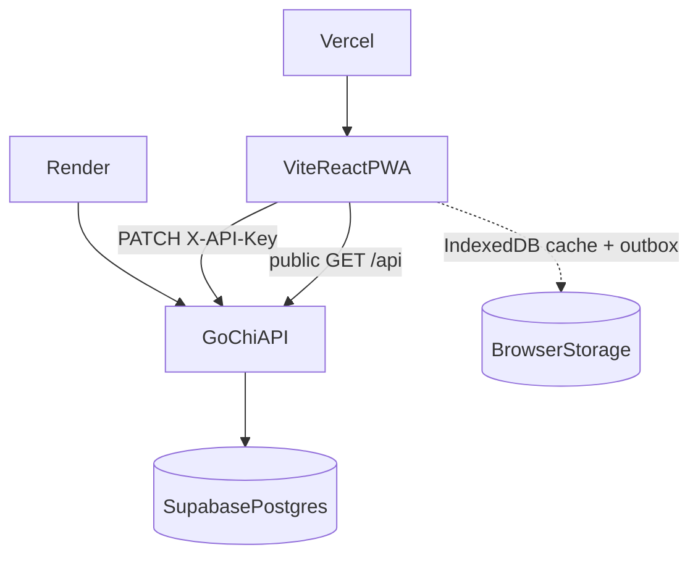
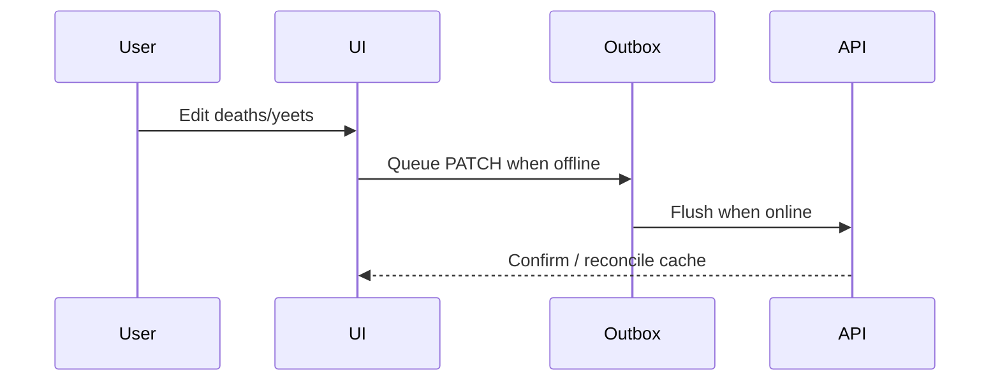

# Architecture

Yeetcraft is a Vite React PWA talking to a Go (chi) API backed by PostgreSQL (typically Supabase). The browser never talks to Supabase directly.

## System context



## Backend layers

```text
cmd/server          HTTP entrypoint
internal/handler    Request validation, JSON mapping
internal/middleware CORS, recover, API key
internal/repository SQL (pgx), season/leader logic
internal/slug       Display-name slug helpers (mirrored on FE)
db/schema.sql       Source of truth for tables
```

Handlers depend on a `StatsRepository` interface so unit tests can use fakes without Postgres.

## Data model (summary)

| Table | Role |
| ----- | ---- |
| `seasons` | Named seasons; partial unique index enforces one `is_current` |
| `players` | Display names (+ optional `avatar_url`) |
| `dungeons` | Canonical dungeon list |
| `season_dungeons` | Which dungeons belong to a season (+ order) |
| `player_dungeon_stats` | Deaths/yeets per player×season×dungeon |

Stats rows FK into `season_dungeons`, so you cannot record stats for a dungeon outside that season. Full DDL: [`backend/db/schema.sql`](../backend/db/schema.sql).

Security helpers and RPCs live in [`backend/db/migrations/002_functions_and_security.sql`](../backend/db/migrations/002_functions_and_security.sql). App writes use repository upserts, not PostgREST.

## Auth model

- **Reads:** public
- **Writes:** shared secret (`API_KEY`) on `PATCH /api/stats/batch` only
- **Fail-closed:** missing `API_KEY` → 503
- **Frontend unlock:** `?token=` → `localStorage` → `X-API-Key` header

Details: [API.md](./API.md).

## Season resolution

Empty `seasonId` query params resolve to the current season. Crowns (King of Yeets / King of Deaths / Top Player) are computed in Go (`ComputeSeasonLeaders`) and covered by unit tests.

Switching the current season is a DB ops concern today (`set_current_season` SQL function) — there is no public admin HTTP endpoint.

## Slug parity

Player, dungeon, and season URL slugs are derived from display names in both:

- `backend/internal/slug`
- `frontend/src/utils/slug.ts`

There is no dedicated slug column; lookups scan by normalized name (acceptable at friend-group scale).

## Offline write path



See [OFFLINE.md](./OFFLINE.md) for service worker, query persistence, and connection UX.

## Planned character and event evolution

Characters are currently frontend-only presentation metadata; statistics remain
owned by players. The implementation brief for moving character metadata into
PostgreSQL and preparing future encounter-derived **Nemesis Boss** insights is
[`CHARACTERS_AND_BOSS_NEMESIS.md`](./CHARACTERS_AND_BOSS_NEMESIS.md).

That work is additive. It must preserve current player-level aggregates and
must not imply that companion ingest, death events, or boss statistics already
exist.
